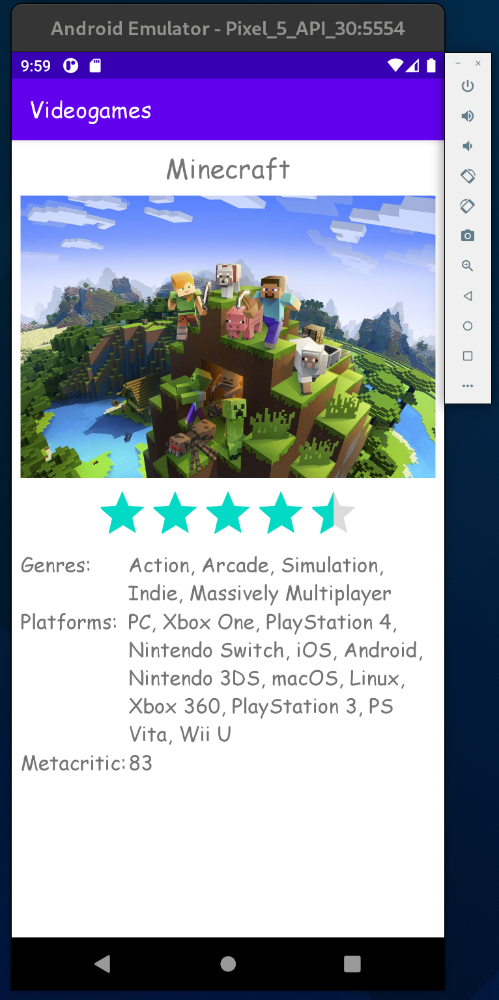

# Übung 4-5

Die App soll eine Liste an Videospielen von Benutzern speichern. Man kann sich registrieren oder mit einem vorhandenen Account anmelden. Bei einem Klick auf ein Videospiel in der Liste öffnet sich ein Fenster wo Details zum Spiel angezeigt werden. Spiele können nach dem Namen gefiltert werden und mit dem Löschen-Symbol von der Liste des Nutzers entfernt werden. Bei dem Hinzufügen-Button wird eine Liste mit "allen" Spielen angezeigt. Durch Klick auf ein Spiel wird es der Liste des Benutzers hinzufügt. Die globale Spielebibliothek kann ebenfalls durchsucht werden.

## Login

Bei ungüligen Anmeldedaten wird der Benutzer über den Fehler informiert.

## Register

Der Nutzer wird bei Klick auf den Registrieren-Button auf die Login-Seite weitergeleitet und über den Status der Registrierung informiert.

## Nutzer-Bibliothek

Der Nutzer kann seine Spiele nach dem Titel filtern, seine Spiele löschen, eine Detailansicht des ausgewählten Spiels anzeigen oder ein neues Spiel zu seiner Bibliothek hinzufügen.

### Spiel-Detailansicht

Hier werden Detail zu dem jeweiligen Spiel angezeigt

## Globale Spielebibliothek

In dieser Ansicht kann der Benutzer “alle” Spiele durchsuchen und durch Klick auf ein Spiel es zu seiner eigenen Bibliothek hinzufügen